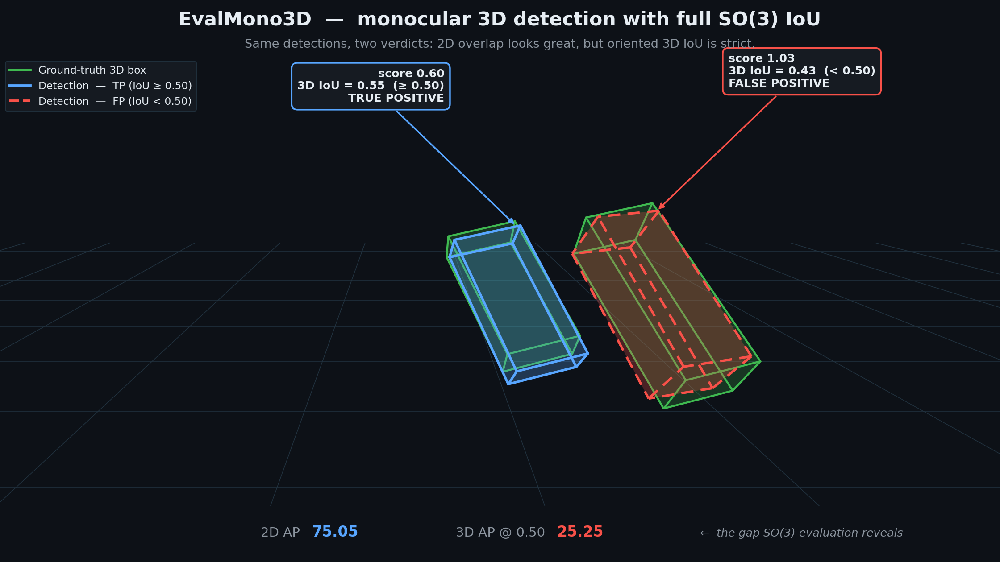

<div align="center">

# EvalMono3D

### Monocular 3D object-detection evaluation with full **SO(3)** rotation

[](https://arxiv.org/abs/2408.11958)
[](https://deepscenario.github.io/CDrone/)
[](LICENSE.md)

The official evaluation toolkit for **[CARLA Drone: Monocular 3D Object Detection from a Different Perspective](https://arxiv.org/abs/2408.11958)** (GCPR 2024, **oral**).



</div>

---

Drone imagery sees objects under **arbitrary 3D orientations**, not just the
gravity-aligned yaw that KITTI / Waymo / nuScenes evaluation assumes.
**EvalMono3D** is a small, stand-alone script that measures 3D Average Precision
using the **full `SO(3)`** volumetric IoU between oriented cuboids — no
`detectron2`, and results are deterministic (a shipped test pins the numbers).

The figure says it all: both detections look perfect in 2D (**2D AP = 75.05**),
but the most confident one is misaligned in 3D — IoU 0.43 < 0.50, a false
positive — so honest 3D evaluation reports **3D AP@0.5 = 25.25**.

## Installation

`pytorch3d` is the only non-trivial dependency (build it against your torch / CUDA;
see its [install guide](https://github.com/facebookresearch/pytorch3d/blob/main/INSTALL.md)).
A tested conda recipe:

```bash
conda create -n evalmono3d python=3.9 -y && conda activate evalmono3d
conda install pytorch=1.13.0 torchvision pytorch-cuda=11.6 -c pytorch -c nvidia -y
conda install pytorch3d -c pytorch3d -y
pip install -e .          # the rest, plus the `evalmono3d` command
```

## Usage

A one-image example (`car` category) ships with the repo:

```bash
evalmono3d \
    --name cdrone_test_example \
    --gt_ann  example/cdrone_test_example.json \
    --pred_ann example/cdrone_test_example_pred.pth \
    --log_dir /tmp/eval_cdrone_test_example
# -> car: AP2D = 75.0495, AP3D@0.5 = 25.2475
```

Or from Python:

```python
from evalmono3d import evaluate, box3d_overlap

results = evaluate("cdrone_test_example",
                   "example/cdrone_test_example.json",
                   "example/cdrone_test_example_pred.pth")
print(results["AP2D"], results["AP3D"])     # 75.0495..., 25.2475...

iou = box3d_overlap(pred_corners, gt_corners)   # (N,8,3),(M,8,3) -> (N,M) SO(3) IoU
```

## Details

- **Metric** — COCO-style AP with greedy score-ordered matching: 2D over
  `IoU = 0.50:0.95` (binned by box area), 3D at `IoU = 0.50` (binned by depth).
- **Filtering** — heavily truncated / barely-visible / out-of-size objects are
  *ignored*; thresholds live in [`evalmono3d/dataset.py`](evalmono3d/dataset.py).
- **Input formats** — Omni3D / Cube R-CNN schema, documented in [DATA.md](DATA.md).
- **Reproducibility** — `pytest -q` pins the published numbers; regenerate the
  figure with `python scripts/visualize.py`.

## Citation

```bibtex
@inproceedings{meier2024cdrone,
  author    = {Meier, Johannes and Scalerandi, Luca and Dhaouadi, Oussema and
               Kaiser, Jacques and Araslanov, Nikita and Cremers, Daniel},
  title     = {{CARLA Drone}: Monocular 3D Object Detection from a Different Perspective},
  booktitle = {German Conference on Pattern Recognition (GCPR)},
  year      = {2024},
}
```

Built on [PyTorch3D](https://github.com/facebookresearch/pytorch3d) and
[Omni3D / Cube R-CNN](https://github.com/facebookresearch/omni3d), and released as
a stand-alone evaluation script under [CC-BY-NC 4.0](LICENSE.md).
